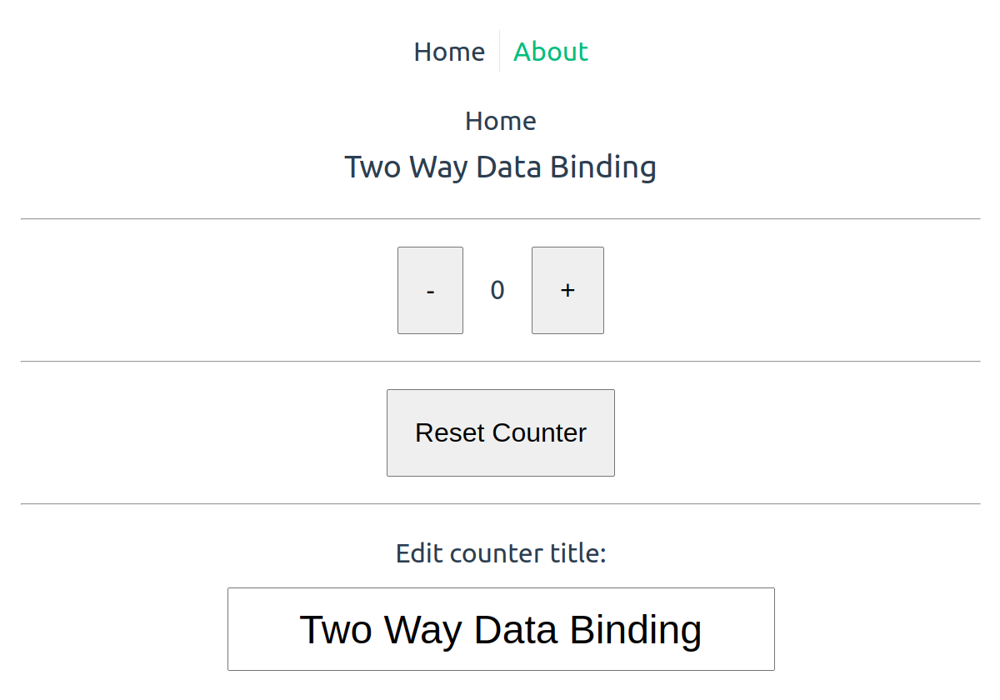
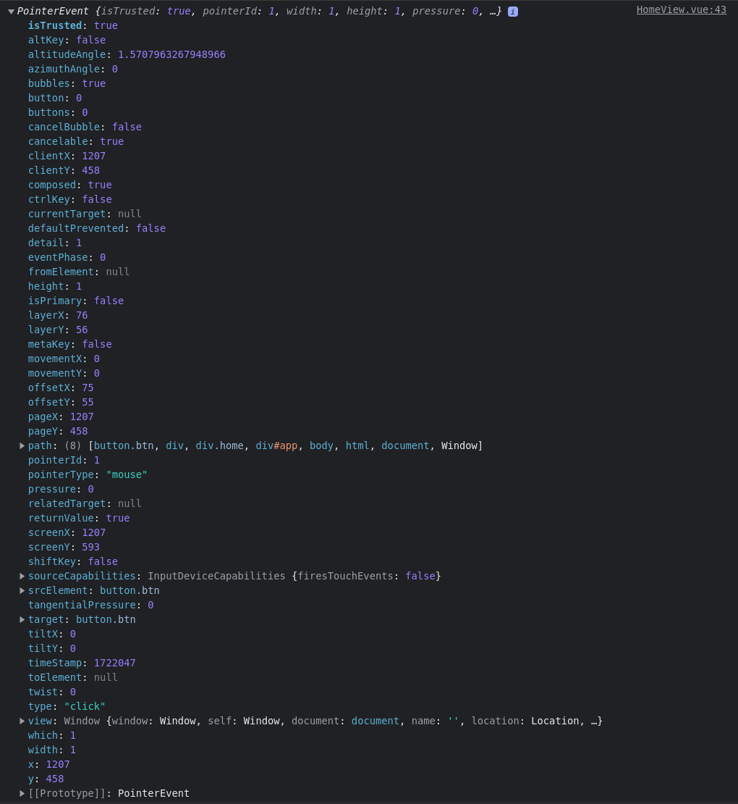
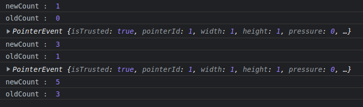
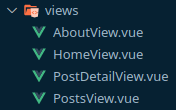
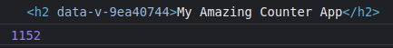

# vue-capi-basics

This template should help get you started developing with Vue 3 in Vite.

## Recommended IDE Setup

[VSCode](https://code.visualstudio.com/) + [Volar](https://marketplace.visualstudio.com/items?itemName=Vue.volar) (and disable Vetur) + [TypeScript Vue Plugin (Volar)](https://marketplace.visualstudio.com/items?itemName=Vue.vscode-typescript-vue-plugin).

## Customize configuration

See [Vite Configuration Reference](https://vitejs.dev/config/).

## Project Setup

```sh
npm install
```

### Compile and Hot-Reload for Development

```sh
npm run dev
```

### Compile and Minify for Production

```sh
npm run build
```

### Lint with [ESLint](https://eslint.org/)

```sh
npm run lint
```

### Lesson 16 - Two Way Data Binding



```html
<h3>{{ counterTitle }}</h3>
```

```html
<div class="edit">
	<h4>Edit counter title:</h4>
	<input v-model="counterTitle" type="text" />
</div>
```

```html
<script setup>
	import { ref } from 'vue';

	const counterTitle = ref('My Counter');
</script>
```

### Lesson 17 - Reactive Objects

Let's say we want to store the `counter` and `counterTitle` in a <strong> Reactive Object </strong> since the data is <strong>RELATED TO EACH OTHER</strong>.

Before

```js
const counter = ref(0);

const counterTitle = ref('My Counter');
```

Setup Reactive Object

```js
const counterData = reactive({
	count: 0,
	title: 'My Counter'
});
```

After

```html
<h3>{{ counterData.title }}</h3>
```

```html
<span class="counter">{{ counterData.count }}</span>
```

```html
<input v-model="counterData.title" type="text" />
```

```js
<script setup>
import { reactive } from 'vue';

// const counter = ref(0); replace with reactive object

// const counterTitle = ref('My Counter'); replace with reactive object

const counterData = reactive({
	count: 0,
	title: 'My Counter'
});

const increaseCounter = () => {
	// counter.value++; replace with reactive object
	counterData.count++;
};

const decreaseCounter = () => {
	// counter.value--; replace with reactive object
	counterData.count--;
};

const resetCounter = () => {
	// counter.value = 0; replace with reactive object
	counterData.count = 0;
};
</script>
```

### Lesson 20 - Pass Parameters To Methods

<strong>Add</strong> a parameter i.e. `(1)` and `(2)` to the `increaseCounter` method

````html
<button @click="increaseCounter(1)" class="btn">+</button>
<button @click="increaseCounter(2)" class="btn">++</button>
```
````

<strong>Receive</strong> the parameter `amount` in the function

```js
const increaseCounter = (amount) => {
	counterData.count += amount;
};
```

#### Access The Event Object On The Button

Use `@event` as a second parameter to the `increaseCounter` method

```html
<button @click="decreaseCounter(2, $event)" class="btn">- -</button>
```

Log the Event Object in the method

```js
const increaseCounter = (amount, event) => {
	counterData.count += amount;
	console.log(event);
};
```



### Lesson 21 - Computed Properties

<strong>Computed Properties are properties which are usually generated based on reactive data which is cached and only updated when their dependencies change.</strong>

In this example the Computer Property `oddOrEven` is based on the computation/calculation of the value of `counterData.count` and the condition in the `computed()` method.

```html
<h4>The Counter Now Shows An {{ oddOrEven }} Number</h4>
```

```js
const oddOrEven = computed(() => {
	if (counterData.count % 2 === 0) {
		return 'Even';
	} else {
		return 'Odd';
	}
});
```

### Lesson 23 - Vue Filters Are No Longer A Thing

https://v3-migration.vuejs.org/breaking-changes/filters.html

To achieve the same behaviour or having a "global filter" we are later going to learn about Vue Composables.  
https://vuejs.org/guide/reusability/composables.html

### Lesson 23 - Watchers

https://vuejs.org/guide/essentials/watchers.html

<strong>Watchers</strong> allow us to watch a reactive data property and then do something whenever it changes - with a callback function.

With Composition API, we can use the `watch()` function to trigger a callback whenever a piece of reactive state changes:

`watch's` first argument can be different types of reactive "sources" - it can be a ref (including computed refs), a reactive object, a getter function, or an array of multiple sources:

```js
const x = ref(0);
const y = ref(0);

// single ref
watch(x, (newX) => {
	console.log(`x is ${newX}`);
});

// getter
watch(
	() => x.value + y.value,
	(sum) => {
		console.log(`sum of x + y is: ${sum}`);
	}
);

// array of multiple sources
watch([x, () => y.value], ([newX, newY]) => {
	console.log(`x is ${newX} and y is ${newY}`);
});
```

`watch's` second argument is the callback function that is run when the first argument changes.

Do note that you can't watch a property of a reactive object like this:

```js
const obj = reactive({
	count: 0
});

// this won't work because we are passing a number to watch()
watch(obj.count, (count) => {
	console.log(`count is: ${count}`);
});
```

Instead, use a getter:

```js
// instead, use a getter
watch(
	() => obj.count,
	(count) => {
		console.log(`count is: ${count}`);
	}
);
```

Coming back to our example, this is quite interesting since `newCount` and `oldCount` are automatically populated with data...

```js
watch(
	() => counterData.count,
	(newCount, oldCount) => {
		console.log('newCount : ', newCount);
		console.log('oldCount : ', oldCount);
	}
);
```


<br>
<br>
...and it turns out this is a

### Deep Watcher

https://vuejs.org/guide/essentials/watchers.html#deep-watchers

When you call `watch()` directly on a reactive object, it will implicitly create a deep watcher - the callback will be triggered on all nested mutations:

```js
const obj = reactive({ count: 0 });

watch(obj, (newValue, oldValue) => {
	//
	// fires on nested property mutations
	//
	// Note: `newValue` will be equal to `oldValue` here
	// because they both point to the same object!
});

obj.count++;
```

This should be differentiated with a getter that returns a reactive object - in the latter case, the callback will only fire if the getter returns a different object:

```js
watch(
	() => state.someObject,
	() => {
		// fires only when state.someObject is replaced
	}
);
```

#### Use with Caution !

> Deep watch requires traversing all nested properties in the watched object, and can be expensive when used on large data structures. Use it only when necessary and beware of the performance implications.

### Lesson 25 - Mounted Hooks

```js
onBeforeMount(() => {
	console.log('onBeforeMount');
});
onMounted(() => {
	console.log('onMounted');
});
onBeforeUnmount(() => {
	console.log('onBeforeUnmount');
});
onUnmounted(() => {
	console.log('onUnmounted');
});
```

### Lesson 26 - Activated Hooks

https://vuejs.org/api/composition-api-lifecycle.html#onactivated

`onActivated()`

```js
onActivated(() => {
	console.log('onActivated');
});
```

Registers a callback to be called after the component instance is inserted into the DOM as part of a tree cached by <KeepAlive>.

<strong>This hook is not called during server-side rendering.</strong>

App.vue

```html
<RouterView v-slot="{ Component }">
	<KeepAlive>
		<component :is="Component" />
	</KeepAlive>
</RouterView>
```

https://vuejs.org/api/composition-api-lifecycle.html#ondeactivated

`onDeactivated()`

```js
onDeactivated(() => {
	console.log('onDeactivated');
});
```

Registers a callback to be called after the component instance is inserted into the DOM as part of a tree cached by <KeepAlive>.

<strong>This hook is not called during server-side rendering.</strong>

App.vue

```html
<RouterView v-slot="{ Component }">
	<KeepAlive>
		<component :is="Component" />
	</KeepAlive>
</RouterView>
```

### Lesson 27 - Updated Hooks

https://vuejs.org/api/composition-api-lifecycle.html#onbeforeupdate

`onBeforeUpdate()`

```js
onBeforeUpdate(() => {
	console.log('onBeforeUpdate');
});
```

Registers a hook to be called right before the component is about to update its DOM tree due to a reactive state change.

https://vuejs.org/api/composition-api-lifecycle.html#onupdated

`onUpdated()`

```js
onUpdated(() => {
	console.log('onUpdated');
});
```

Registers a callback to be called after the component has updated its DOM tree due to a reactive state change.

#### Lifecycle


### Lesson 30 - Local Custom Directives

Let's create a local custom directive that automatically puts focus to the input element of the counter app once the component is created - so we use the `mounted` lifecycle hook.

https://vuejs.org/guide/reusability/custom-directives.html#custom-directives

In `<script setup>`, any camelCase variable that starts with the "v" prefix can be used as a custom directive.

Here we define the custom directive and

```js
const vAutofocus = {
	mounted: (element) => {
		console.log(element);
		element.focus();
	}
};
```

Here we insert the custom directive.

```html
<input type="text" v-autofocus />
```

Note the `mounted` in the directive object.

https://vuejs.org/guide/reusability/custom-directives.html#directive-hooks

A directive definition object can provide several hook functions (all optional).

```js
const myDirective = {
	//
	// called before bound element's attributes
	// or event listeners are applied
	created(el, binding, vnode, prevVnode) {
		// see below for details on arguments
	},
	//
	// called right before the element is inserted into the DOM.
	beforeMount() {},
	//
	// called when the bound element's parent component
	// and all its children are mounted.
	mounted() {},
	//
	// called before the parent component is updated
	beforeUpdate() {},
	//
	// called after the parent component and
	// all of its children have updated
	updated() {},
	//
	// called before the parent component is unmounted
	beforeUnmount() {},
	//
	// called when the parent component is unmounted
	unmounted() {}
};
```

### Lesson 31 - Global Custom Directives

Import the `vAutofocus` directive from `/src/directives/vAutofocus.js` and use it in the template.

```js
export const vAutofocus = {
	mounted: (element) => {
		console.log(element);
		element.focus();
	}
};
```

```js
import { vAutofocus } from '@/directives/vAutofocus';
```

```html
<input v-model="counterData.title" type="text" v-autofocus />
```

### lesson 33 - 35 - Router

`src/router/index.js`

```js
import { createRouter, createWebHistory } from 'vue-router';
import HomeView from '../views/HomeView.vue';

const router = createRouter({
	history: createWebHistory(import.meta.env.BASE_URL),
	routes: [
		{
			path: '/',
			name: 'home',
			component: HomeView
		},
		{
			path: '/about',
			name: 'about',
			// route level code-splitting
			// this generates a separate chunk (About.[hash].js) for this route
			// which is lazy-loaded when the route is visited.
			component: () => import('../views/AboutView.vue')
		},
		{
			path: '/posts',
			name: 'posts',
			component: () => import('../views/PostsView.vue')
		},
		{
			path: '/post/:id',
			name: 'post',
			component: () => import('../views/PostDetailView.vue')
		}
	]
});

export default router;
```

App.vue

```html
<template>
	<nav>
		<RouterLink to="/">Home</RouterLink>
		<RouterLink to="/about">About</RouterLink>
		<RouterLink to="/posts">Posts</RouterLink>
	</nav>
	<RouterView />
</template>
```

```js
import { createApp } from 'vue';
import { createPinia } from 'pinia';

import App from './App.vue';
import router from './router';

const app = createApp(App);

app.use(createPinia());
app.use(router);

app.mount('#app');
```

Finally, create the Views in `src/views/`.



### Lesson 39 - Template Ref

```html
<h2 ref="appTitleRef">{{ appTitle }}</h2>
```

```js
const appTitleRef = ref(null);

onMounted(() => {
	console.log(appTitleRef.value);
	console.log(appTitleRef.value.offsetWidth);
});
```



### Lesson 40 - nextTick

https://vuejs.org/api/general.html#nexttick

A utility for waiting for the next DOM update flush.

`nextTick`allows us to wait until the DOM has updated and then do something. It will wait for all changes to the DOM and then run a callback function.

`nextTick` waits for the next change to the view. This could be many different things, e.g. a dialog appears, a button appears, some text changes etc. Basically any change to the view which is caused by Vue.

```js
const increaseCounter = (amount, event) => {
	counterData.count += amount;
	console.log(event);
	//
	// nextTick
	//
	nextTick(() => {
		console.log('Do something when counter had updated in the DOM');
	});
};
```

<strong>Note</strong> - `nextTick` is asynchronous so can also be called like this.

```js
<script setup>
import { ref, nextTick } from 'vue'

const count = ref(0)

async function increment() {
  count.value++

  // DOM not yet updated
  console.log(document.getElementById('counter').textContent) // 0

  await nextTick()
  // DOM is now updated
  console.log(document.getElementById('counter').textContent) // 1
}
</script>
```

```html
<template>
	<button id="counter" @click="increment">{{ count }}</button>
</template>
```

### Lesson 41 - Teleport

Teleport allows us to move elements in the DOM.
